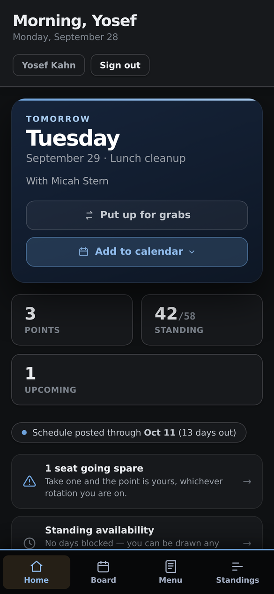
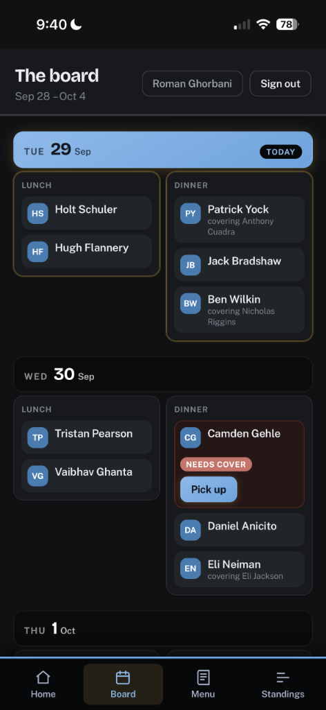
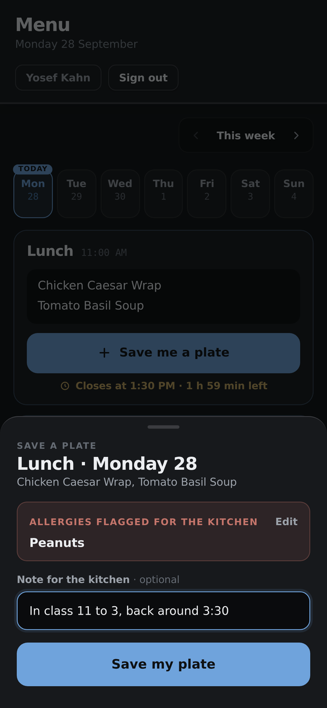
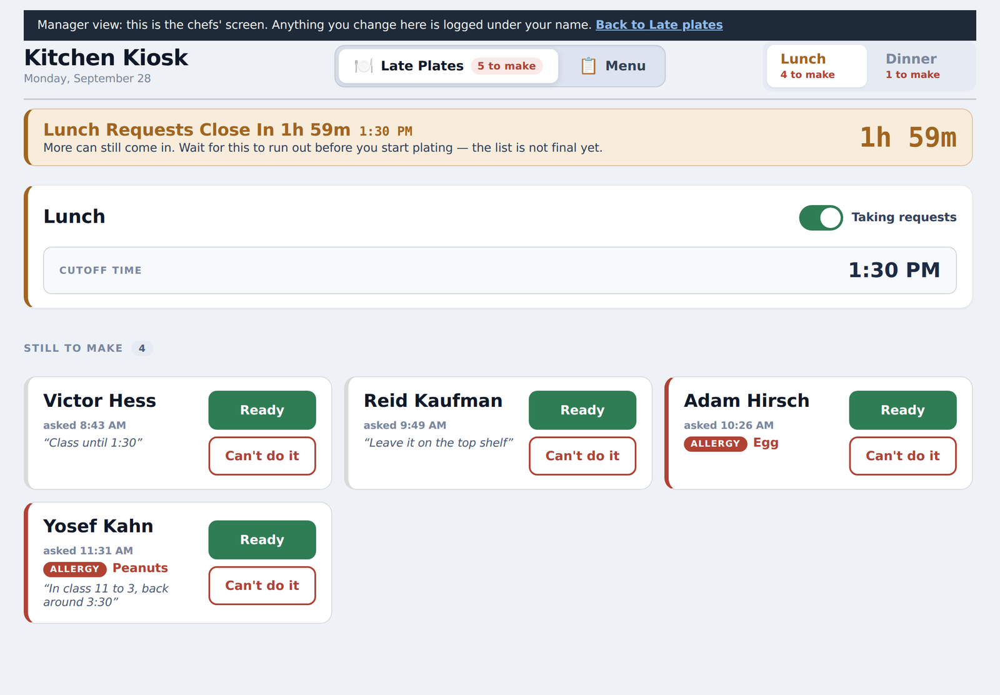
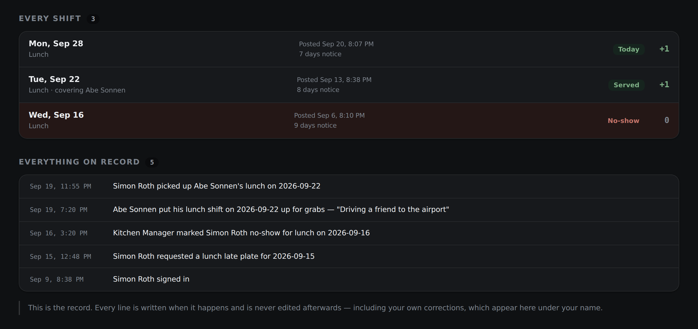
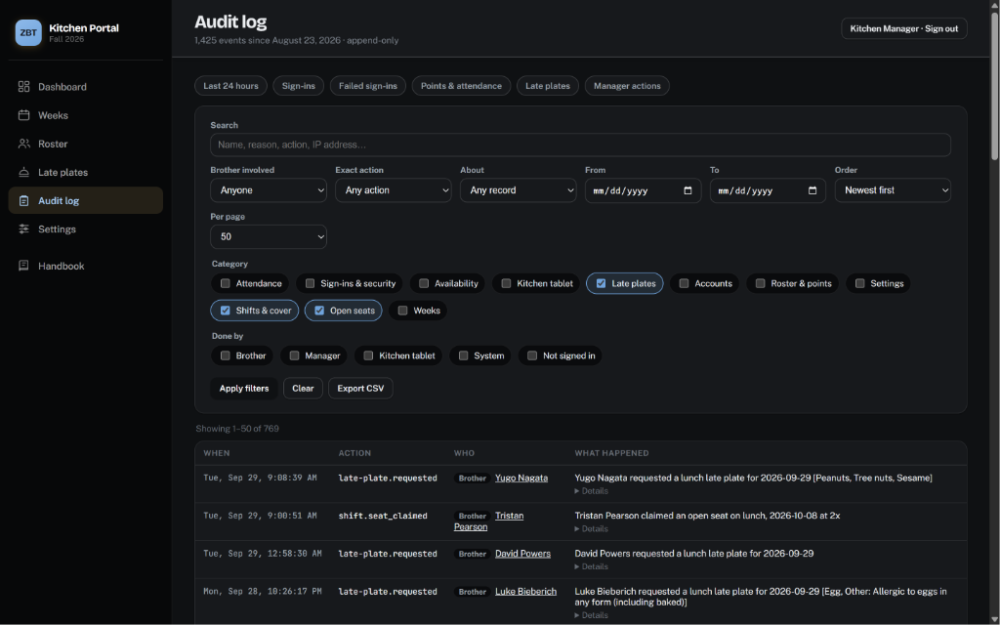
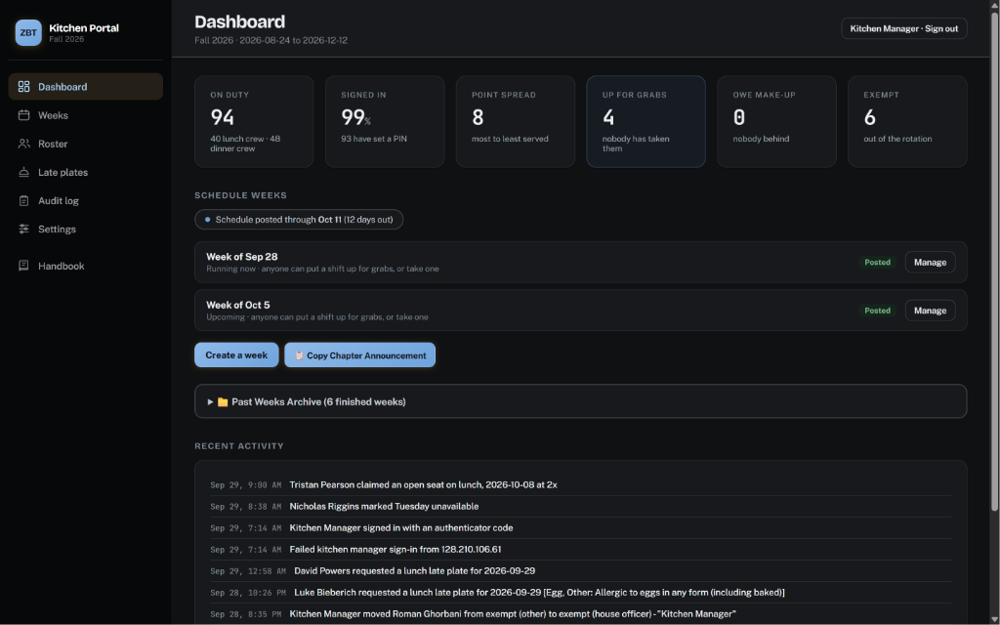
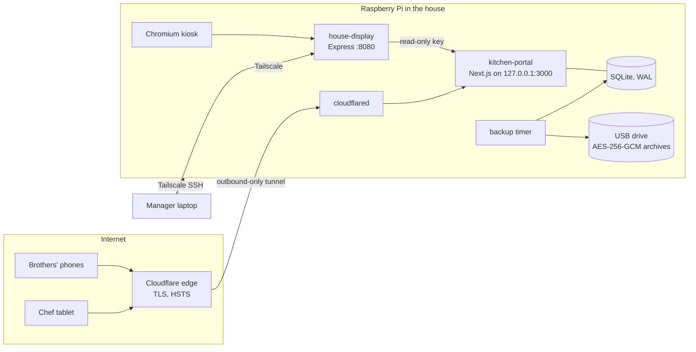

# Kitchen Portal

Kitchen duty scheduling, late plates and menus for a fraternity chapter house
of about 95 residents. Self-hosted on a Raspberry Pi, published through a
Cloudflare Tunnel, and paired with **house-display**, a companion project that
runs the dining room TV from the same Pi.

I built it as the chapter's Kitchen Manager and IT Manager to replace a
group-chat screenshot of the duty rotation, a sign-up sheet on the chefs' cart,
and "I never knew I was on" arguments. The brothers, the chefs and the
manager use it daily.

| For | What they get |
|---|---|
| **Brothers** (phone) | Their next shift and history, the week's board, putting a shift up for grabs or taking one, the day's menu, requesting a late plate with their allergies attached, a points standings list, and a profile they keep up to date themselves |
| **Chefs** (kitchen tablet) | The live late plate queue with mandatory allergy acknowledgement, cutoff controls, and the menu editor |
| **Kitchen manager** (desktop) | Drawing and posting weeks, attendance, roster management (import, rotations, exemptions, bulk points, setup codes), the kitchen tablet, the full audit log, and an in-app [handbook](docs/HANDBOOK.md) |
| **Out-of-house seniors** | A read-only weekly menu behind a shared password |

<p align="center">
  
  
  
</p>

| The chefs' lunch queue on the kitchen tablet | Every shift on a brother's record, with when it was posted |
|---|---|
|  |  |





<sub>Screenshots use the demo roster from `src/db/seed.ts --demo`; no real brothers appear.</sub>

---

## Architecture



- **One process, one file.** Next.js App Router with server actions, Drizzle
  ORM over `better-sqlite3`. The workload is ~95 people and a few dozen writes
  a week, so a local SQLite file beats a network database on every axis that
  matters here: latency, cost, and the ability to back it up with one API call.
- **Nothing listens on the house network.** The app binds `127.0.0.1`; the only
  way in from outside is the Cloudflare Tunnel, which the Pi dials out to. The
  house display's consoles answer only loopback and Tailscale addresses.
- **The audit log is the product.** Every consequential write appends an
  `events` row, and nothing updates or deletes one. When somebody says they
  never knew about a shift, the answer is a timestamped chain rather than
  recollection.

The scheduler (`src/lib/scheduler.ts`) and points arithmetic
(`src/lib/settlement.ts`) are pure functions with no database, which is why
they are the most heavily tested code in the repository.

## Security

The app is on a public hostname and the roster of names is visible on the
sign-in page, so the design assumes the attacker is someone who knows the
house. [SECURITY.md](SECURITY.md) has the threat model; in short:

| Concern | Control |
|---|---|
| Claiming someone else's account | One-time **setup codes** issued by the manager (keyed hash at rest, single use, 7-day expiry). Picking a name is no longer enough. |
| Guessing a PIN | **Escalating lockout** per account and per IP, stored in SQLite so a restart does not reset it. New PINs are six digits and reject runs and repeats. PINs are **scrypt**-hashed. |
| Stolen or stale sessions | HMAC-signed cookies carrying a **credential version**, checked on every request. A PIN reset, PIN change or "sign out everywhere" ends every older session immediately. |
| The manager account | **scrypt** password hash plus **TOTP** (RFC 6238, replay-protected), 12-hour session, never extended. Rotating either secret ends existing sessions. |
| The chef tablet | **Paired** with a short-lived code; afterwards an httpOnly cookie whose secret is stored hashed. Each tablet is listed and revocable. No token ever sits in a URL. |
| The dining room TV | A separate **read-only key** for two endpoints that return names and counts only, never dietary information. |
| Everything else | CSP, `frame-ancestors 'none'`, nosniff, strict referrer policy; no CORS; signed calendar-feed URLs; formula-safe CSV export; systemd sandboxing. |

Every sign-in, failure, lockout, code issued, tablet paired and export taken is
in the audit log.

## Audit log

`/admin/audit` shows the entire log with SQL-side filtering and paging:
free-text search (summaries, actors, payloads - an IP address works), action
category or exact action, who acted (brother, manager, kitchen tablet, system,
not signed in), a brother involved (as actor, subject, or via his shifts), the
record type, and an inclusive date range on the house clock. Every view is a
URL, and any view exports to CSV.

## Roster

The roster is meant to be run by whoever is kitchen manager this year,
without help from whoever built it:

- **Import** a roster from the chapter's export, a spreadsheet, cells pasted
  from Sheets, or a typed list with headings. Columns are recognised by name in
  any order; contact details are ignored and never stored. The import shows
  every add, update and removal for approval before anything is written, and
  the server re-plans from the same text rather than trusting the preview
  (`src/lib/roster-intake.ts`, `src/lib/roster-plan.ts`).
- **Bulk actions** on any selection: move rotations, exempt with a reason, issue
  setup codes, take off the roster. Points can be added, subtracted, set or
  rebased for a selection or a whole crew, with a preview and a reason that
  lands on each brother's record (`src/lib/points-ops.ts`).
- **Profiles:** class year, room, pledge class, Slack ID and private manager
  notes. Brothers edit their own room, Slack ID and allergies.
- **Semesters** roll over from Settings, carrying the roster, points and house
  settings forward.

## Backups

`npm run backup` takes an online SQLite snapshot, checks `integrity_check`,
`foreign_key_check` and a row count per table, writes a manifest of SHA-256
checksums, and packs the database with the environment file into an
**AES-256-GCM** archive. It then re-opens the archive and verifies it before
reporting success. A systemd timer runs it nightly onto a USB drive.

`npm run restore` verifies before it touches anything, refuses while the app is
running, sets the current database aside rather than deleting it, applies any
newer migrations, and checks the result against the manifest.

`npm run backup:drill` proves the round trip on a copy: back up, destroy,
restore, and compare every table row for row. It also checks that a wrong
passphrase and a tampered archive are both refused.

---

## Running it locally

```bash
npm install
cp .env.example .env.local      # set SESSION_SECRET at least
npm run db:migrate              # creates ./data/kitchen.db
node --env-file=.env.local --experimental-strip-types src/db/seed.ts --demo
npm run dev                     # http://localhost:3000
```

For a manager login, run `npm run admin:credentials` and put the two lines it
prints into `.env.local`.

| Command | |
|---|---|
| `npm test` | Unit and integration tests against a throwaway migrated database |
| `npm run typecheck` | TypeScript, no emit |
| `npm run build` / `npm start` | Production build; `start` binds 127.0.0.1 |
| `npm run db:generate` | New migration after changing `src/db/schema.ts` |
| `npm run db:migrate` | Apply migrations (Node 20 compatible, no drizzle-kit needed) |
| `npm run backup` / `restore` / `backup:drill` | See above |
| `npm run admin:credentials` | Manager password hash and TOTP secret |

End-to-end checks that need a populated database live in `scripts/smoke-*.ts`
and refuse to run unless `DATABASE_FILE` names a scratch path.

## Deploying on the Pi

Full procedure, including moving an existing install over, is in
[docs/OPERATIONS.md](docs/OPERATIONS.md). The short version:

1. `sudo bash deploy/setup-pi.sh` - builds, migrates, installs
   `kitchen-portal.service` and the reminder timer.
2. Point a Cloudflare Tunnel at `127.0.0.1:3000`
   ([example config](deploy/cloudflared/config.yml.example)).
3. `sudo bash deploy/setup-usb-backup.sh` - mounts the backup drive and
   enables the nightly backup timer.
4. From then on, `./deploy.sh` from a clean working tree: typecheck, test,
   push, back up, build, restart, health-check, and roll back if unhealthy.

## How the house rules are encoded

- **Who is on duty.** Each brother is on a lunch or a dinner rotation, or exempt.
  The rotation is a per-person field; class year is only a profile fact, used to
  pick the default rotation when someone is added or imported (juniors lunch,
  sophomores dinner, seniors exempt, all configurable in Settings).
- **Selection order** for an open seat: make-up debt owed, then fewest points,
  then longest since last served, then a random draw seeded by the week - so a
  week can always be reproduced exactly.
- **Hard constraints:** the right crew, exempt members excluded, standing
  weekly conflicts respected, one shift per Monday-Sunday week except make-ups.
- **Cover.** A brother can put a shift up for grabs at any time; it stays his
  until someone takes it, and only whoever serves earns the point.
- **Attendance is assumed.** Points are credited when a week is posted.
  Corrections are expressed as a desired end state, so they are idempotent and
  reversible.
- **Posted weeks are never regenerated.** What the house was told is the record.
- **Points carry over between semesters.** They are how the draw stays fair
  over a brother's whole time in the house; the manager can rebase them (take
  the lowest score off everyone) without changing anyone's place.

## Repository map

```
src/
  app/(app)/        brother and manager pages (App Router)
  app/kitchen/      the chef tablet: queue, menu editor, pairing
  app/api/          JSON endpoints: late plates, menus, display, calendar, cron, health
  app/actions/      server actions (all writes from the UI)
  lib/              domain logic: scheduler, settlement, auth, throttle, audit, kiosk
  db/               Drizzle schema, client, seed
drizzle/            SQL migrations
scripts/            backup, restore, drill, migrate, credentials, test runner, smoke tests
deploy/             systemd units, Cloudflare Tunnel example, Pi setup
docs/               manager handbook, API reference, operations, late plates
```

## License

MIT. See [LICENSE](LICENSE).
